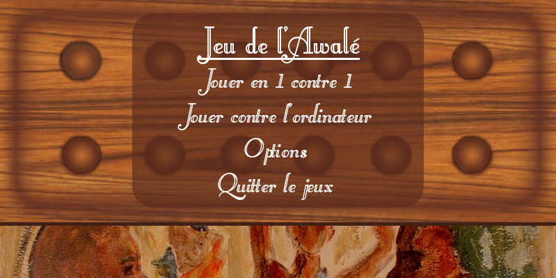
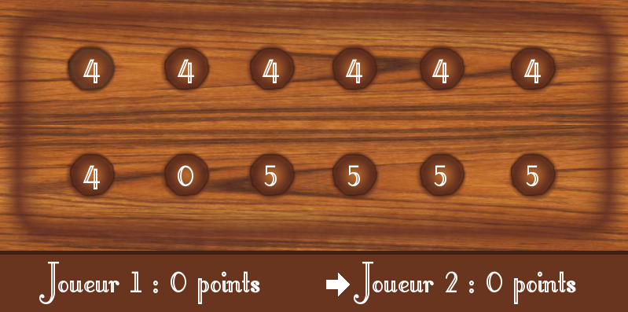

# Jeu de l'Awalé

Ce projet est une implémentation C/C++ du jeu de l'Awalé.
Les règles du jeu sont disponibles en suivant [ce lien](http://www.lecomptoirdesjeux.com/l-awale.htm).

Le projet utilise CMake (`>= 3.0.2`) pour compiler.
Il y a plusieurs dépendances:
- SDL: `= 1.2`,
- SDL_image: `= 1.2`,
- SDL_ttf: `= 2.0`,
- FMOD (optionnel pour le son): `>= 1.10.11`.

## Installer les dépendances sous Linux/Ubuntu

```bash
sudo apt install cmake g++ libsdl1.2-dev libsdl-image1.2-dev libsdl-ttf2.0-dev
```

Pour installer FMOD (pour avoir le son), il faut télécharger la bibliothèque directement sur [ce site](https://www.fmod.com/download).

## Compiler le jeu

```bash
mkdir build
cd build
cmake .. -DCMAKE_BUILD_TYPE="Release"
make
```

## Lancer le jeu

Il faut faire attention à bien se placer dans le dossier `build` et faire:
```bash
./bin/awale
```

## Fonctionnalités

Le jeu permet de jouer:
- à un contre un sur le même écran,
- contre l'ordinateur (avec plusieurs niveaux de difficultés),
- en mode console en modifiant en faisant: `./bin/awale --console`,
- réseau (encore au niveau de prototype et demande de modifier le code).



